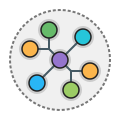

# picsumvision

See it live: [picsumvision.mahanna.dev](https://picsumvision.mahanna.dev/)

An image repository allowing you to:
1. Search for images by keyword or URL
2. Discover images similar to click history
3. Visualize results as a graph network

Built with Lorem Picsum Photos, Google Vision, and ArangoDB 🥑

## Developer Setup (est time: 8 minutes)

Note: You can replace `yarn` with `npm run`.

1. `git clone https://github.com/aMahanna/picsumvision.git`
2. `cd picsumvision`
3. `cp .env.example .env`
4. `yarn setup`
5. `python -m venv .venv`
6. Activate Virtual Environment
   1. MacOS / Linux: `source .venv/bin/activate`
   2. Windows: `.venv/scripts/activate`
7. `pip install -e .[dev]`
8. `docker-compose up -d`
9. `yarn db:onboard`
10. Import Picsum Vision Data
     1. Via data restore: `yarn db:restore`
     2. Via data insert: `yarn db:populate`
         1. Note: requires `GOOGLE_APPLICATION_CREDENTIALS` key
11. `yarn dev`

 

