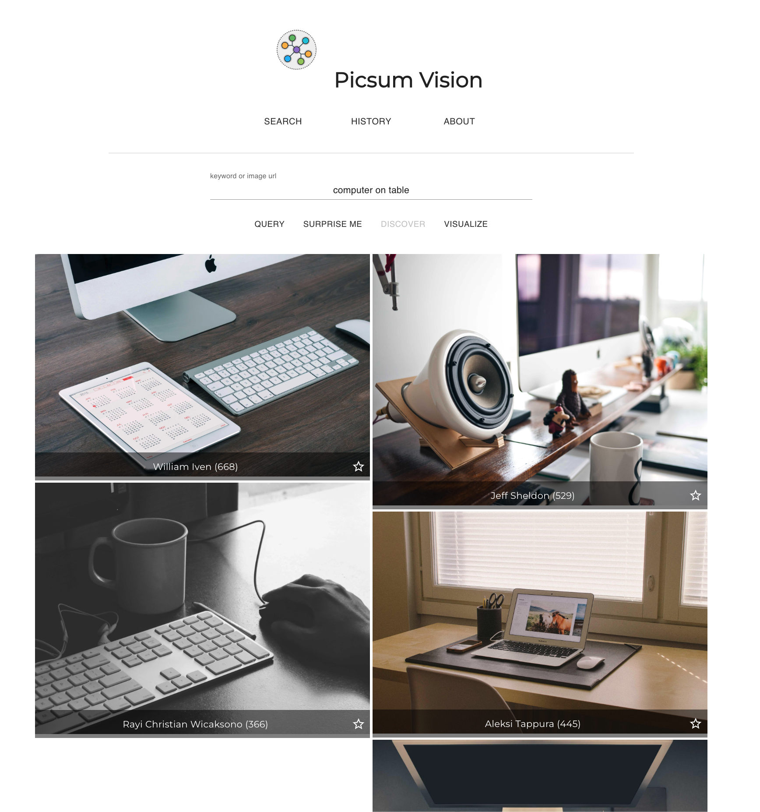
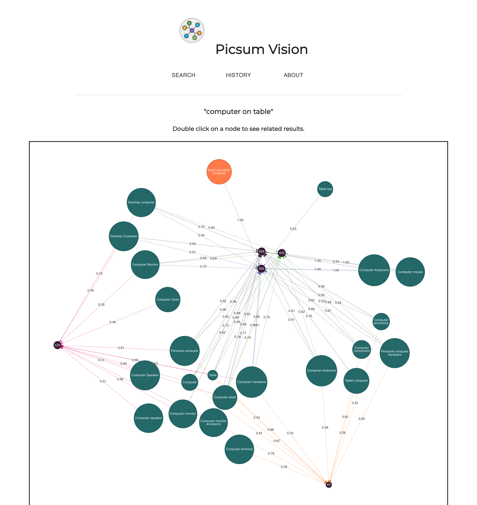
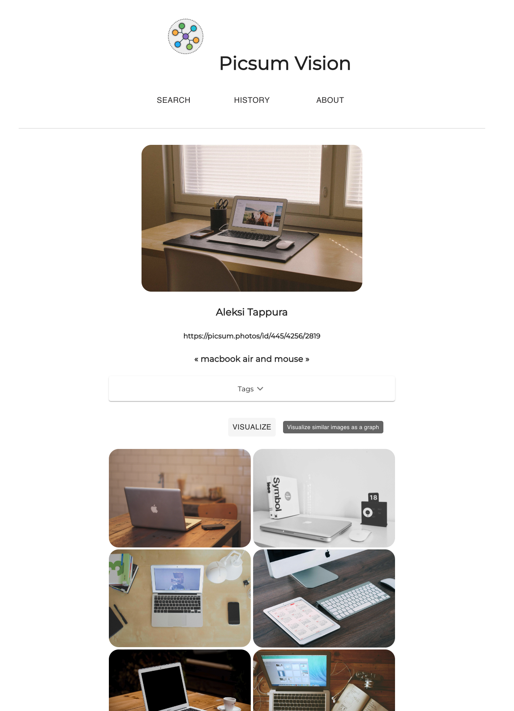

# picsumvision

[picsumvision.mahanna.dev](https://picsumvision.mahanna.dev/) (app might be sleeping, just refresh if Railway page shows up) 

An image repository allowing you to:
1. Search for images by keyword or URL
2. Discover images similar to click history
3. Visualize results as a graph network

Built with Lorem Picsum Photos, Google Vision, and ArangoDB 🥑

This project was submitted as a Shopify Developer Challenge on May 9th 2021, but has continued to grow since. If you would like to see the state of the project as of May 9th only, you can rollback to the following commit: [53e84e8](https://github.com/aMahanna/picsumvision/commit/53e84e86a1a61560acead5ff91cf3d86f6c94f0e)

## Developer Setup (est time: 8 minutes)

Note: You can replace `yarn` with `npm run`.

1. `git clone https://github.com/aMahanna/picsumvision.git`
2. `cd picsumvision`
3. `cp .env.example .env`
4. `yarn setup`
5. `python -m venv .venv`
6. Activate Virtual Environment
   1. MacOS / Linux: `source .venv/bin/activate`
   2. Windows: `.venv\Scripts\activate`
7. `pip install -e '.[dev]'`
8. `docker compose up -d`
9. `yarn db:onboard`
10. Import Picsum Vision Data
    1. Via data restore: `yarn db:restore`
    2. Via data insert: `yarn db:populate`
        1. Note: requires `GOOGLE_APPLICATION_CREDENTIALS` key
11. `yarn dev`

## Deployment

Deploy to Railway for free (with $5/month credits):

1. **Fork/Clone** this repository
2. **Sign up** at [railway.app](https://railway.app)
3. **Create project** → Deploy from GitHub repo
4. **Add ArangoDB** as a separate service (Docker: `arangodb/arangodb:3.12`)
5. **Set environment variables** (see [DEPLOYMENT.md](./DEPLOYMENT.md))
6. **Initialize database**: `railway run python scripts/onboard.py`
7. **Import data**: `railway run python scripts/restore.py`

📖 **Detailed deployment guide**: See [DEPLOYMENT.md](./DEPLOYMENT.md)

|                                                      |                                                    |                                                      |
| :---------------------------------------------------: | :------------------------------------------------: | :--------------------------------------------------: |
|  |  |  |
